# Parkinson's Monitoring System
### Hardware-Software Co-Design on Zynq-7000 SoC (ZedBoard)

## 📌 Project Overview
This project implements an end-to-end diagnostic pipeline to detect Parkinson's Disease through the analysis of spiral drawing patterns. By leveraging the **Zynq-7000 SoC**, the system combines a high-level Python-trained neural network with custom FPGA hardware acceleration to achieve high-speed, real-time inference.

---

## 🛠 Engineering Workflow
The repository is structured to reflect the complete development lifecycle, from model training to hardware deployment:

### 📂 [01_ML_Model_Python](./01_Python)
* **Objective**: Train the diagnostic "brain" using deep learning.
* **Activities**: 
    * Dataset preprocessing and normalization of spiral images to $128 \times 128$ resolution.
    * Convolutional Neural Network (CNN) construction using TensorFlow and Keras.
    * Exporting trained weights into a C++ header (`weights.h`) for hardware compatibility.

### 📂 [02_Vitis_HLS_IP](./02_Vitis_HLS)
* **Objective**: Transform software logic into hardware RTL.
* **Activities**: 
    * Developing HLS-optimized C++ kernels to implement the CNN layers.
    * Generating a custom IP core to be used in the Vivado Block Design.

### 📂 [03_Vivado_Hardware](./03_Vivado)
* **Objective**: SoC Architecture Design and Integration.
* **Activities**: 
    * Integrating the HLS IP with the Zynq Processing System (PS) via AXI4 interconnects.
    * Configuring hardware constraints and generating the bitstream for the ZedBoard.

### 📂 [04_Vitis_IDE_App](./04_Vitis_ide)
* **Objective**: Embedded Software Deployment.
* **Activities**: 
    * Developing the final C application to manage data flow between the ARM processor and FPGA logic.
    * System verification using "Golden Logits" to ensure hardware-software parity.

---

## 🚀 Hardware & Tools
* **Development Board**: Avnet ZedBoard (Zynq-7000)
* **Camera Sensor**: OV7670 (connected via Pmod/GPIO)
* **Software Stack**: Vivado ML, Vitis HLS, Vitis IDE, and Google Colab (Python 3)

---
# Images and Results

---

## Experimental Setup

  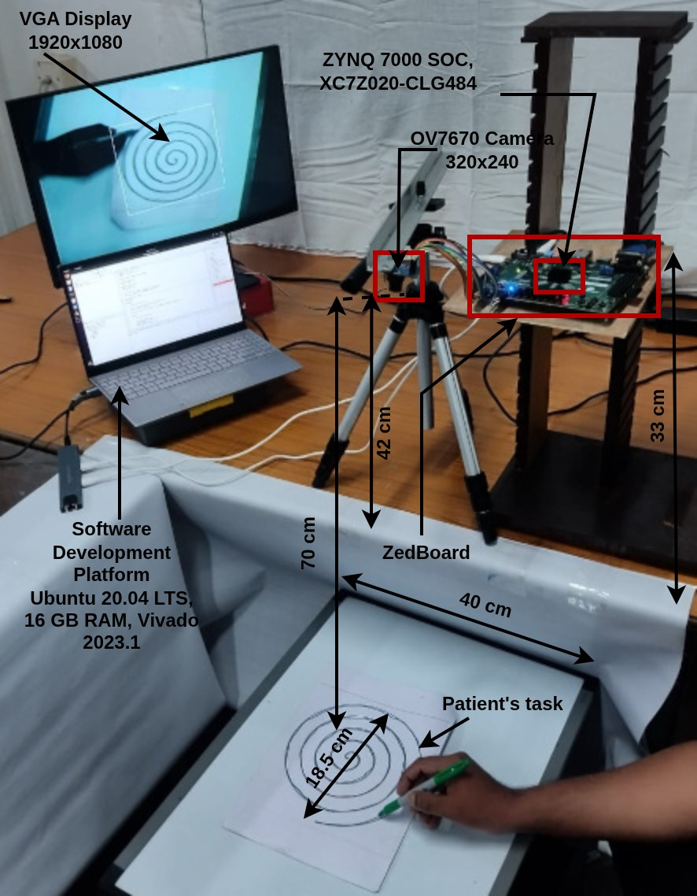

  <em>
    Real-time experimental setup consisting of the Zynq-7000 ZedBoard,
    OV7670 camera module, VGA display, and live handwriting acquisition platform.
  </em>

---

## Healthy Control Handwriting Sample

  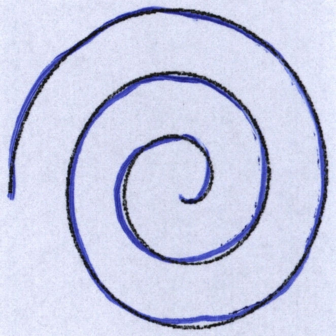

  <em>
    Sample handwriting image from a healthy control subject used for CNN training and testing.
  </em>

---

## Parkinson’s Disease Handwriting Sample

  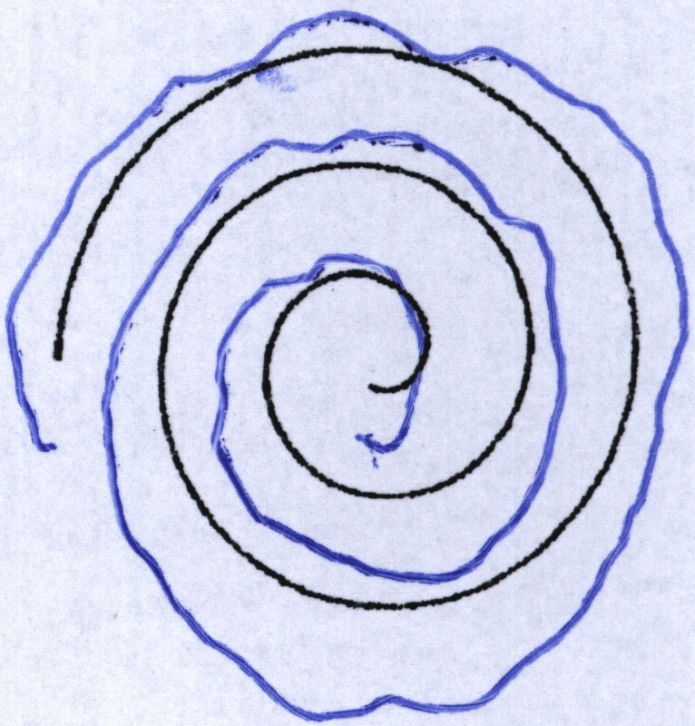

  <em>
    Sample handwriting image from a Parkinson’s Disease patient showing motor irregularities.
  </em>

---

## Meander Healthy Sample

  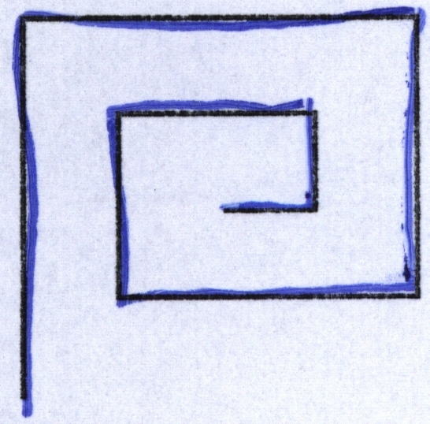

  <em>
    Meander drawing pattern from a healthy subject.
  </em>

---

## Meander Parkinson’s Sample

  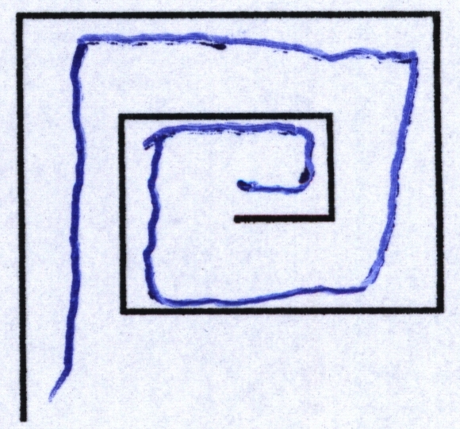

  <em>
    Meander drawing pattern from a Parkinson’s Disease patient.
  </em>

---

## Hardware and Camera Interface

  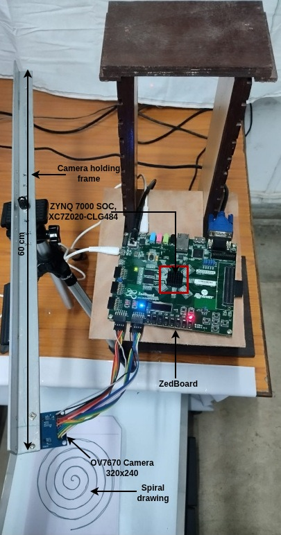

  <em>
    Hardware integration of OV7670 camera module with ZedBoard for real-time image capture.
  </em>

---

## Hardware–Software Co-simulation

  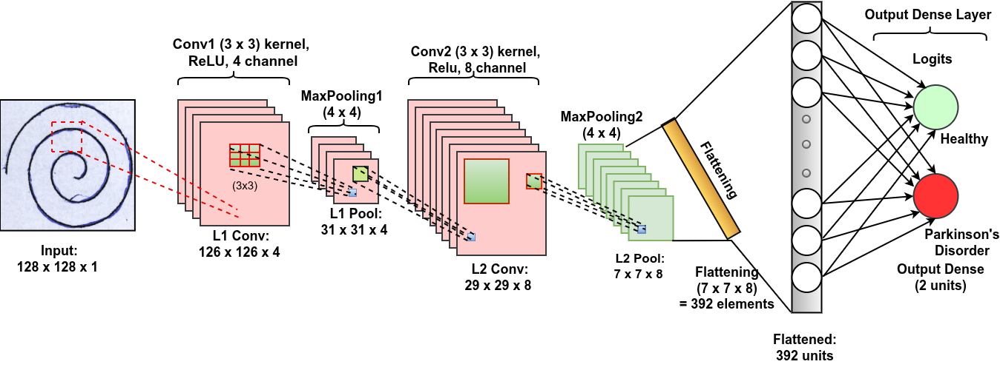

  <em>
    Hardware–software co-simulation results validating CNN accelerator functionality.
  </em>

---

## Simplified SoC Architecture

  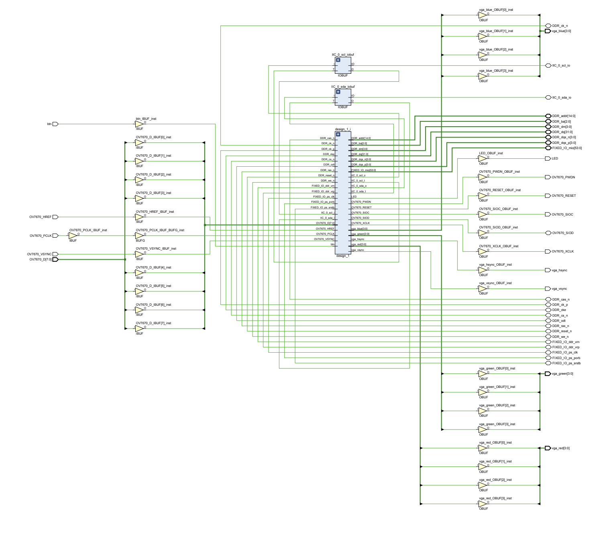

  <em>
    Simplified AXI-based Zynq SoC architecture integrating Processing System and CNN accelerator.
  </em>

---

## Workflow Diagram

  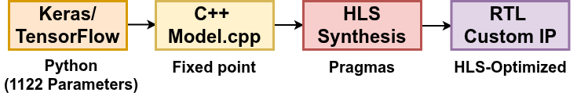

  <em>
    Complete software-to-hardware workflow for CNN model deployment using Vivado HLS.
  </em>

---

## Spiral Curve Accuracy and Loss

  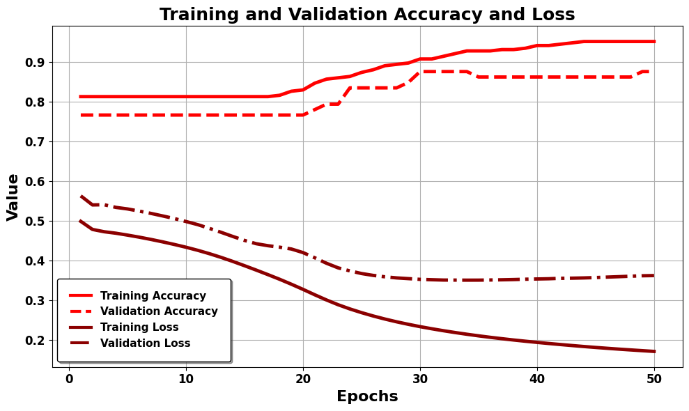

  <em>
    Training and validation accuracy/loss curves for spiral handwriting classification.
  </em>

---

## Meander Curve Accuracy and Loss

  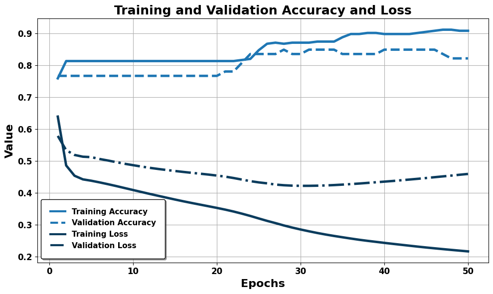

  <em>
    Training and validation accuracy/loss curves for meander handwriting classification.
  </em>

---

## Spiral Power Consumption

  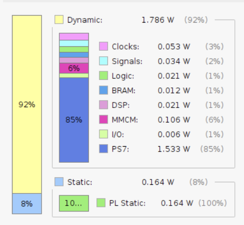

  <em>
    On-chip power consumption breakdown for spiral image processing.
  </em>

---

## Meander Power Consumption

  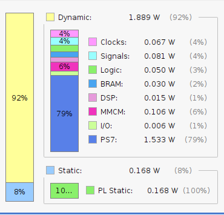

  <em>
    On-chip power consumption breakdown for meander image processing.
  </em>

---

## Real-Time Prediction Output

  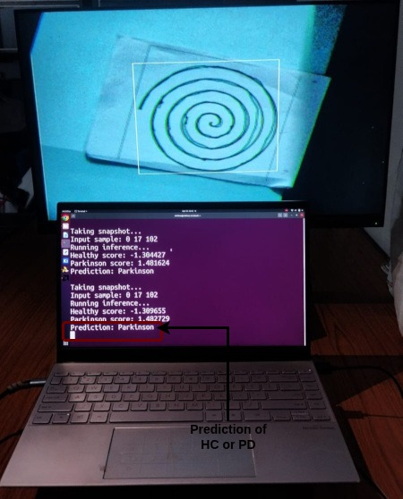

  <em>
    Real-time Parkinson’s Disease prediction output displayed during live inference.
  </em>

---

---

## 📊 Performance
The model utilizes optimized CNN layers to identify tremors with high precision. Detailed accuracy charts and loss curves are located in the [01_ML_Model_Python](./01_ML_Model_Python) folder.
